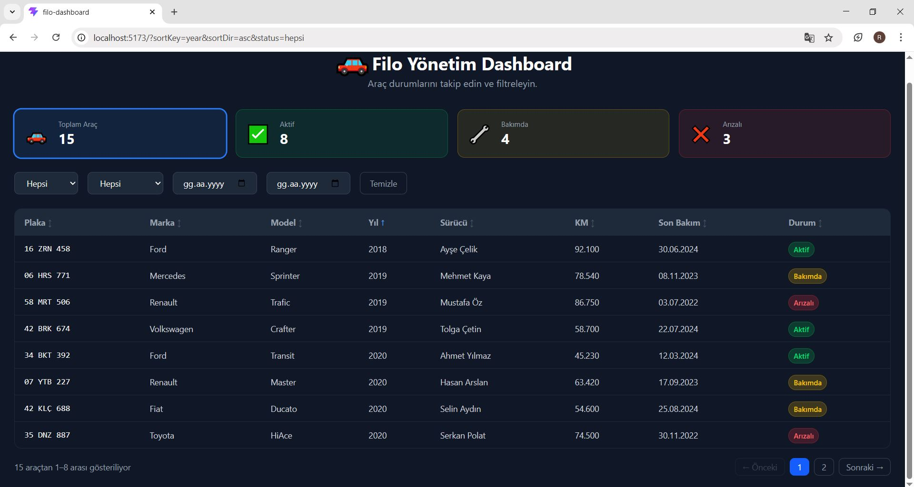
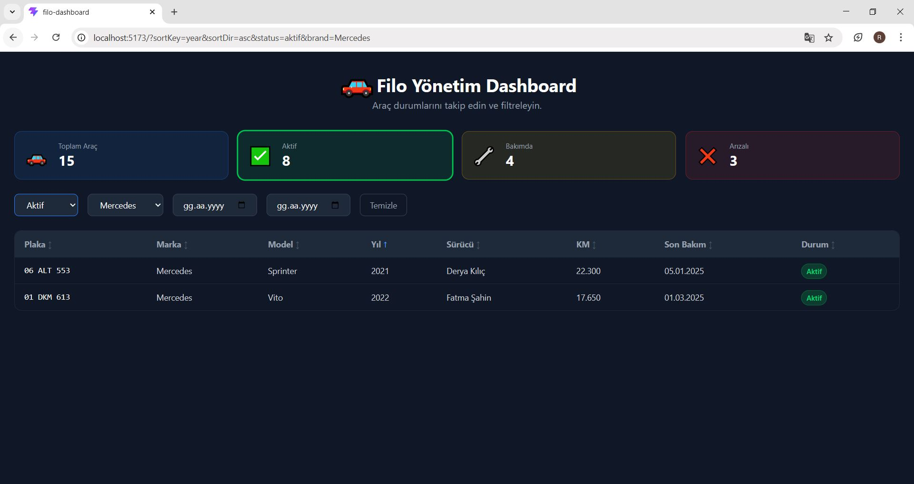
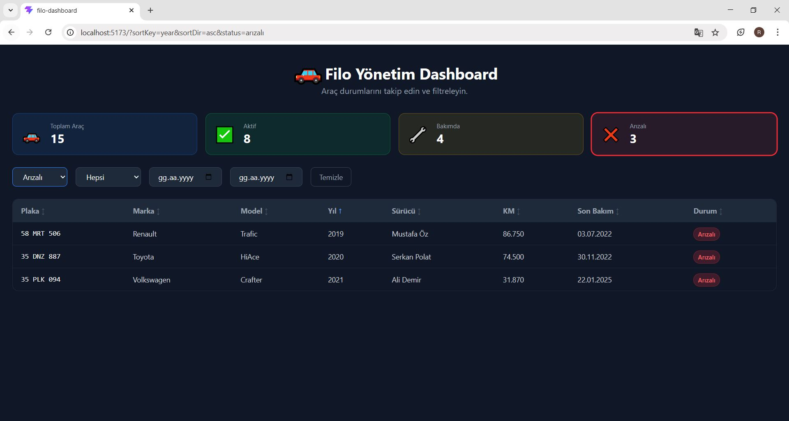
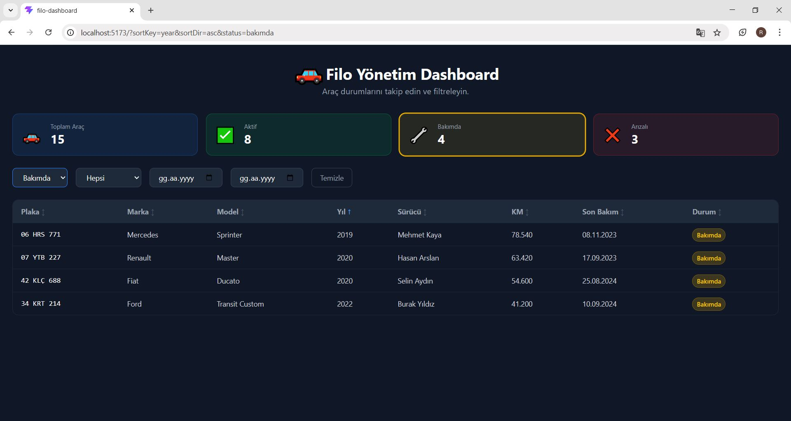

https://github.com/user-attachments/assets/5b125c45-b768-4db2-a62a-4af242bbad53

# 🚗Filo Yönetim Dashboard (React — araç takip dashboard'u)

Filo araçlarının listelendiği, filtrelenip sıralanabildiği bir yönetim dashboard'u.

## 🚀 Kurulum

```bash
npm install
npm start
```

Tarayıcıda `http://localhost:5173` adresini aç.

## 🌐 Canlı Demo

[https://react-arac-takip-dashboard.vercel.app](https://react-arac-takip-dashboard.vercel.app)

## 🖥️ Özellikler

- **Filtreleme** — Durum, marka ve tarih aralığına göre filtrele
- **Sıralama** — Sütun başlığına tıklayarak sırala (artan/azalan)
- **Durum badge'leri** — Aktif, Bakımda, Arızalı renk kodlu gösterim
- **Detay modalı** — Araç kartına tıkla, ESC ile kapat
- **Loading skeleton** — Veri yüklenirken animasyonlu iskelet ekran
- **Hata yönetimi** — Hata durumunda retry butonu
- **URL query params** — Filtre ve sıralama URL'ye yansır
- **Sayfalama** — Sayfa başına 8 araç
- **İstatistik kartları** — Toplam, aktif, bakımda, arızalı araç sayıları

## 🛠️ Teknolojiler

- React
- TypeScript
- Tailwind CSS
- Context API
- React Router DOM
- Vite

## 📸 Ekran Görüntüleri

### Ana Dashboard


### Aktif Araçlar


### Arızalı Araçlar


### Bakımdaki Araçlar

